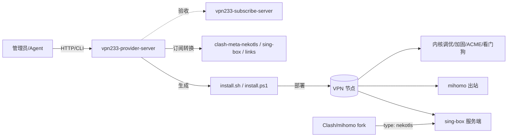

# vpn233-provider-server


> 文档站点（GitHub Pages）：<https://neko233-com.github.io/vpn233-provider-server/>
> Agent First 文档：<https://neko233-com.github.io/vpn233-provider-server/agent-first.html>

Go 1.26 版本的 agent-first VPN 管理端，面向 **provider-server** 与 **subscribe-server** 的一体化联调场景，提供：

- 浏览器后台管理（内置管理面板）
- `root / root` 默认管理员
- sing-box 可直接启动的多协议服务端模板
- mihomo 可直接运行的出站管理模板（`proxies / groups / rules`）
- **NekoTLS**（neko233 自研协议）：AnyTLS 外层 + ECH/Reality 伪装，sing-box 以原生 `anytls` 直接落地，Clash/mihomo 经 fork 原生支持 `type: nekotls`
- 订阅转换：`clash-meta-nekotls` / `clash` / `clash-meta` / `sing-box` / `links` 多目标输出
- **超高性能内核调优**：BBR/自定义拥塞控制、TCP Fast Open、MPTCP、巨型读写缓冲、conntrack/句柄上限（百万级连接）
- **安全加固**：sysctl 加固、fail2ban SSH 防爆破、systemd 资源限额与能力收敛
- **可运维性**：ACME 正式证书自动签发/续期、自愈看门狗、日志轮转、一键备份/恢复/更新/卸载
- 裸脚本下载接口与 provider 管理面板自安装脚本
- 与订阅服务器联动的验收接口与仓库自动状态检查
- **proxysss 网关联动**：一键生成 `proxysss.yaml`、通过 proxysss admin API 自动注册 provider 路由
- **server.yaml 单文件配置**：provider 主配置只写 `server.yaml`；旧 `agent-config.json` 仅用于自动迁移

> 说明：目标是“可落地的傻瓜化一键配置 + 高性能 + 订阅验收能力”，并不承担完整流量计费系统。

## 架构一览



- **provider-server**：生成安装脚本与订阅、提供面板/CLI/本地 HTTP
- **节点**：脚本部署 sing-box/mihomo + 性能调优 + 安全加固 + 可运维组件
- **客户端**：Clash/mihomo fork 原生 `type: nekotls`，sing-box 以原生 `anytls` 作服务端

## 运行行为（与订阅仓库联动）

服务启动时会读取 `server.yaml` 并执行仓库状态检查：

- 当前目录是 root git 仓库时：不强制再次拉取
- 当前目录为子 git 仓库时：跳过对 `vpn233-subscribe-server` 的自动拉取
- 其他场景（非 git 或非 root）：尝试按配置克隆/更新 `vpn233-subscribe-server`

默认订阅仓库配置：

- `subscribe_repo_url`: `https://github.com/neko233-com/vpn233-subscribe-server.git`
- `subscribe_repo_path`: `vpn233-subscribe-server`
- `subscribe_repo_branch`: `main`

以上配置可在 `GET/POST /api/v1/config` 中查看和修改。

## 快速启动

```bash
go mod tidy
go test ./...
go run .
```

默认监听 `http://0.0.0.0:8080`，访问 `http://<ip>:8080/` 打开管理面板。

## 一键安装管理面板本身

Linux:

```bash
bash <(curl -fsSL https://raw.githubusercontent.com/neko233-com/vpn233-provider-server/main/install-server.sh)
```

Windows:

```powershell
Invoke-WebRequest -UseBasicParsing https://raw.githubusercontent.com/neko233-com/vpn233-provider-server/main/install-server.ps1 -OutFile install-server.ps1
powershell -ExecutionPolicy Bypass -File .\install-server.ps1
```

安装脚本会：

- 安装或检查 `Go 1.26`
- 拉取/更新 `vpn233-provider-server`
- 生成默认 `server.yaml`
- 注册 `vpn233-provider-server` 常驻服务
- 自动放行管理面板端口
- 安装管理命令：Linux `vpn233-provider`，Windows `vpn233-provider.ps1`

## 登录

- 默认账号密码：`root / root`
- 登录成功后获取 `Bearer` token，用于调用管理接口

## API

- `POST /api/v1/login`
- `GET /api/v1/health`
- `GET /api/v1/protocols`
- `GET /api/v1/config`
- `POST /api/v1/config`
- `POST /api/v1/generate`
- `GET /api/v1/generate?format=sh|ps1`
- `GET /api/v1/generate.sh`
- `GET /api/v1/generate.ps1`
- `GET /api/v1/repo/status`（管理认证）
- `POST /api/v1/repo/sync`（管理认证）
- `GET /api/v1/subscribe/verify`（供订阅服务调用，支持 `token`）
- `GET /api/v1/subscribe/convert`（订阅转换，支持 `target` 与 `token`）
- `GET /api/v1/gateway/proxysss.yaml`（生成 proxysss 网关 + DNS-01 ACME YAML，管理认证）
- `POST /api/v1/gateway/register`（通过 proxysss admin API 自动注册 provider 路由，管理认证）

`GET` 生成接口支持 query 参数：

基础：

- `node_name`
- `node_ip`
- `use_mihomo=true|false`
- `use_singbox=true|false`
- `port_base`
- `admin_password`
- `uuid`
- `password`
- `selected_protocols=singbox-vless-grpc,mihomo-vless-reality-grpc`

性能 / 安全 / 运维（均可选，省略时采用安全默认）：

| 参数 | 默认 | 说明 |
| --- | --- | --- |
| `enable_bbr=true\|false` | `true` | BBR + 内核网络调优总开关 |
| `tcp_congestion=bbr\|cubic\|...` | `bbr` | TCP 拥塞控制算法 |
| `enable_tcp_fastopen=true\|false` | `true` | TCP Fast Open (TFO) |
| `enable_mptcp=true\|false` | `false` | Multipath TCP（需内核支持） |
| `conn_limit=<n>` | `1048576` | nofile/nproc 与 systemd `LimitNOFILE` |
| `enable_hardening=true\|false` | `true` | 安全加固 sysctl |
| `enable_fail2ban=true\|false` | `true` | fail2ban SSH 防爆破 |
| `enable_logrotate=true\|false` | `true` | 日志轮转 |
| `enable_watchdog=true\|false` | `true` | 自愈看门狗（systemd timer） |
| `enable_acme=true\|false` | 有域名时默认开 | 申请 Let's Encrypt 正式证书 |
| `acme_domain=<domain>` | 空 | ACME 证书域名 |
| `acme_email=<email>` | 自动生成 | ACME 注册邮箱 |

示例：

```bash
curl -sL -H "Authorization: Bearer $TOKEN" \
  "http://127.0.0.1:8080/api/v1/generate?format=sh&node_name=edge-a&node_ip=203.0.113.8&use_singbox=true&use_mihomo=true&selected_protocols=singbox-vless-grpc,singbox-vless-reality-grpc,mihomo-vless-grpc" \
  -o edge-a-install.sh
```

## 订阅验收接口 `/api/v1/subscribe/verify`

订阅服务器可用此接口进行上线前联调检查：

```bash
curl "http://127.0.0.1:8080/api/v1/subscribe/verify?token=VERIFY_TOKEN"
```

返回字段：

- `ok`：`true/false`
- `service`：`vpn233-provider-server`
- `version`：当前 provider 版本字符串
- `git_root`：当前 git 工作区
- `protocols`：可用协议清单
- `repo_state`：订阅仓库地址/分支/路径/状态

## 生成脚本参数（`/api/v1/generate`）

```json
{
  "node_name": "vpn233-node",
  "node_ip": "auto",
  "use_mihomo": true,
  "use_singbox": true,
  "enable_bbr": true,
  "port_base": 10000,
  "admin_password": "xxx",
  "uuid": "optional",
  "password": "optional",
  "selected_protocols": [
    "singbox-vless",
    "singbox-vmess",
    "singbox-trojan",
    "singbox-shadowsocks"
  ]
}
```

返回：

```json
{
  "shell": "bash 内容",
  "ps1": "powershell 内容",
  "node": {
    "name": "...",
    "node_ip": "...",
    "uuid": "...",
    "password": "...",
    "ports": [
      {
        "id": "singbox-vless",
        "name": "VLESS",
        "core": "singbox",
        "port": 10000
      }
    ]
  }
}
```

## 超高性能内核调优

生成的节点脚本会写入 `/etc/sysctl.d/99-vpn233.conf` 并应用：

- **拥塞控制**：`tcp_congestion=bbr`（可改 `cubic` 等）+ `fq` qdisc，`bbr` 会自动 `modprobe tcp_bbr`
- **大缓冲**：`rmem_max/wmem_max=128MB`、`tcp_rmem/tcp_wmem` 高水位、`udp_rmem_min/udp_wmem_min`（利好 QUIC/Hysteria2/TUIC）
- **高并发**：`somaxconn=65535`、`tcp_max_syn_backlog=65535`、`netdev_max_backlog=250000`、`tcp_tw_reuse`、`ip_local_port_range`拉满
- **TFO**：`tcp_fastopen=3`（`enable_tcp_fastopen`）
- **MPTCP**：`net.mptcp.enabled=1`（`enable_mptcp`，需内核 5.6+）
- **句柄/连接上限**：`fs.file-max=2097152`、`fs.nr_open`、`nf_conntrack_max`，同时写入 `/etc/security/limits.d/99-vpn233.conf` 与 systemd `DefaultLimitNOFILE`（`conn_limit`，默认 1048576）
- **systemd 服务加固**：`LimitNOFILE` / `LimitNPROC` / `AmbientCapabilities=CAP_NET_ADMIN CAP_NET_RAW CAP_NET_BIND_SERVICE`

## 安全加固

- **sysctl 加固**（`enable_hardening`）：`tcp_syncookies`、`rp_filter`、禁止 ICMP 重定向/源路由、`kptr_restrict`、`dmesg_restrict` 等
- **fail2ban**（`enable_fail2ban`）：自动安装并下发 `sshd` jail，防 SSH 暴力破解（best-effort，不中断安装）
- **最小权限能力**：服务仅授予网络相关 capability

## ACME 正式证书

传入域名时（`node_ip` 为域名）默认开启，也可显式 `enable_acme=true`：

- 使用 [acme.sh](https://github.com/acmesh-official/acme.sh) 以 `--standalone` 模式申请 Let's Encrypt ECC 证书
- 证书安装到 `$DATA_DIR/tls/server.crt|server.key`，覆盖自签证书
- 自动配置续期与 `reloadcmd`；手动续期：`vpn233-node cert-renew`
- 申请失败（端口 80 被占/解析未生效）会自动回退到自签证书，不中断安装

```bash
curl "http://127.0.0.1:8080/api/v1/generate.sh?node_ip=edge.example.com&enable_acme=true&acme_domain=edge.example.com&acme_email=ops@example.com&selected_protocols=singbox-nekotls"
```

## server.yaml（唯一主配置）

provider 现在只写 `server.yaml`。如果工作目录里仍有旧的 `agent-config.json`，启动时会自动读取并迁移到同目录的 `server.yaml`。

```yaml
listen_addr: "0.0.0.0"
listen_port: 8080
admin_user: "root"
admin_password: "root"

proxysss:
  enabled: true
  admin_url: "http://127.0.0.1:7777"
  bearer_token: "change-me"
  provider_route_name: "vpn233-provider-panel"
  provider_subdomain: "panel"
  upstream: "http://127.0.0.1:8080"

dns_automation:
  enabled: true
  provider: "cloudflare"
  api_token: "cf-token"
  email: "ops@example.com"
  base_domain: "example.com"
  production: true
  challenge: "dns01"
  create_wildcard: true
```

完整示例见 [server.yaml](server.yaml)。

## proxysss 网关 + DNS 自动化

`proxysss` 本身是 **YAML-only** 网关，因此 provider 直接对接它的单文件配置和 admin automation API：

- **Gateway 计划**：`GET /api/v1/gateway/proxysss.yaml` 生成完整 `proxysss.yaml`
- **DNS-01 ACME**：读取 `dns_automation.*` 生成 `http.tls.mode=acme_managed` + `challenge=dns01`
- **自动注册**：`POST /api/v1/gateway/register` 调 proxysss `POST /v1/domain-routes/upsert`

生成的 gateway YAML 内置：

- `http.plain_bind/tls_bind/h3_bind`
- `admin.enable_write_ops=true`
- `monitoring.path=/metrics`
- `runtime.performance` 与 `runtime.watchdog`
- provider 面板域名路由（默认 `panel.<base_domain>` → `http://127.0.0.1:8080`）

示例：

```bash
curl -s http://127.0.0.1:8080/api/v1/local/gateway/proxysss.yaml -o proxysss.yaml
proxysss -config ./proxysss.yaml check-config
proxysss -config ./proxysss.yaml start

curl -X POST http://127.0.0.1:8080/api/v1/local/gateway/register
```

## 核心行为

- 所有端口按 `port_base + N * 11` 自动分配
- sing-box 配置落盘：`/etc/vpn233/singbox/config.json`
- sing-box TLS 材料落盘：`/etc/vpn233/tls/server.crt` 与 `server.key`
- mihomo 配置落盘：`/etc/vpn233/mihomo/config.yaml`（可直接运行）
- 运行时元数据落盘：`/etc/vpn233/runtime/node-manifest.json` 与 `links.txt`
- 生成脚本支持 Linux `.sh` 与 Windows `.ps1`
- 端口与服务名默认做一键放行与基础优化
- 默认生成 `Reality` 公钥、`ShortID`、`gRPC service_name`、`WireGuard` 客户端材料
- 已内置“协议能力矩阵”：会根据是否提供域名自动推荐默认协议
- 安装后自动注入管理命令：`vpn233-node`

## 当前协议覆盖

- sing-box：`NekoTLS`、`VLESS TCP`、`VLESS gRPC`、`VLESS Reality`、`VLESS Reality gRPC`、`AnyTLS`、`VMess TCP`、`VMess WS`、`Trojan`、`Trojan gRPC`、`Shadowsocks 2022`、`Hysteria2`、`TUIC`、`WireGuard`、`SOCKS5`、`HTTP`
- mihomo：`NekoTLS`、`VLESS TCP`、`VLESS gRPC`、`VLESS Reality gRPC`、`AnyTLS`、`VMess TCP`、`VMess WS`、`Trojan`、`Trojan gRPC`、`Shadowsocks 2022`、`Hysteria2`、`TUIC`、`WireGuard`

## 默认协议策略

- `无域名 / IP / auto`：默认优先 `NekoTLS（Reality 借壳）` 与 `VLESS-Reality`
- `有域名`：默认优先 `NekoTLS（ECH 隐藏 SNI）`，并保留 `AnyTLS` 兼容位
- `NekoTLS` 服务端在 sing-box 上以原生 `anytls` 入站落地（免域名可自签启动），客户端的指纹/ECH/Reality 伪装由 mihomo fork 的 `type: nekotls` 完成
- `AnyTLS` 在本项目里支持“免域名可启动”的自签证书模式，但真正高安全默认仍建议你给它换成正式证书
- 标准 `mihomo` 官方不支持 `AnyTLS + Reality`，域名隐匿方向建议走 `ECH`；`NekoTLS` 把指纹 + ECH + Reality 统一封装，因此需要 fork

## NekoTLS（neko233 自研协议）

NekoTLS 是 vpn233 的旗舰自研协议：

- **外层线路**：AnyTLS 兼容流（TLS 1.3 + padding/多路复用），因此 **stock sing-box 的原生 `anytls` 入站即可作为服务端**，开箱可落地。
- **伪装层**（由 mihomo fork 实现，无上游核心一次性提供）：uTLS Chrome 指纹 + ECH（域名模式隐藏 SNI）+ Reality 借壳（免域名模式）+ AnyTLS padding。
- **模式自适应**：
  - 域名节点 → ECH，`sni` = 真实域名，校验真实证书
  - 免域名 / IP 节点 → Reality 借壳，`sni` = 借壳站点
- **能力矩阵字段**：`supports_ech`、`supports_reality`、`subscribe_target=clash-meta-nekotls`，UI 自动呈现。
- **生成产物**：sing-box `anytls` 服务端 + mihomo `type: nekotls` 出站 + `nekotls://` 分享链接。

> 协议契约（`NekoTLSOption` / `DecodeNekoTLSOption`）定义在 [nekotls.go](nekotls.go)，既是 provider 的生成依据，也是 mihomo fork 的加载契约。CI 会用同一个解码器校验所有生成产物，保证 fork 可加载。

## 订阅转换 target

`GET /api/v1/subscribe/convert?target=<target>&node_ip=<ip>`（携带 `token` 与 `/api/v1/generate` 相同的 query 参数）：

| target | 输出 | 说明 |
| --- | --- | --- |
| `clash-meta-nekotls` | mihomo(fork) YAML | 默认目标，保证含 `type: nekotls` |
| `clash-meta` / `clash` | mihomo/clash YAML | 自动把 NekoTLS 降级为 `anytls`，stock 核心可解析 |
| `sing-box` | sing-box JSON | 原生 `anytls` 入站等价配置 |
| `links` | 文本 | 分享链接（含 `nekotls://`） |

```bash
curl "http://127.0.0.1:8080/api/v1/subscribe/convert?target=clash-meta-nekotls&node_ip=203.0.113.10&use_mihomo=true"
```

## mihomo fork（type: nekotls）

要让 Clash/mihomo **原生**识别 `type: nekotls` 必须 fork（stock 核心无法解析未知 `type:`）。fork 计划、参考 adapter 骨架与示例配置见 [mihomo-fork/PLAN.md](mihomo-fork/PLAN.md)。fork 仅需改动**出站解析 + 一个 outbound**，伪装能力全部复用 mihomo 已有的 `anytls / ech / reality / utls` 组件。

## 安装后管理命令

节点安装脚本会额外写入 `vpn233-node`（完整运维面）：

服务控制：

- `vpn233-node status` / `restart` / `stop` / `reload`

观测与诊断：

- `vpn233-node stats`（服务/套接字/conntrack 统计）
- `vpn233-node top`（实时连接）
- `vpn233-node doctor`（体检：服务状态/拥塞控制/nofile/证书到期）
- `vpn233-node speedtest`（节点测速）
- `vpn233-node version`

运维：

- `vpn233-node backup [path]` / `restore <backup.tar.gz>`
- `vpn233-node update`（拉取 sing-box / mihomo 最新版并重启）
- `vpn233-node cert-renew`（ACME 续期）
- `vpn233-node uninstall`（带二次确认的完整卸载）

路由策略：

- `vpn233-node show-manifest` / `show-links` / `show-config`
- `vpn233-node enable-bt-block` / `disable-bt-block`
- `vpn233-node add-block-domain example.com` / `remove-block-domain example.com`

provider 管理面板安装脚本会额外写入：

- Linux: `vpn233-provider`
- Windows: `vpn233-provider.ps1`

## 自动化测试与验证

### 本地测试

```bash
go test ./...
```

### 一键验收脚本

项目提供 `scripts/verify.sh` 与 `scripts/verify.ps1`，用于 CI 或本地流水线：

- 运行单测
- 启动临时服务
- 访问 `/api/v1/health`
- 登录后台并读取 `/api/v1/repo/status`
- 调用 `/api/v1/subscribe/verify` 与 `/api/v1/protocols`（含 NekoTLS）
- 调用 `/api/v1/subscribe/convert?target=clash-meta-nekotls` 并断言 `type: nekotls`
- 生成全量节点脚本并断言含 `tune_performance/apply_security_hardening/install_watchdog/issue_acme_cert`
- 生成 `proxysss` 网关 YAML 并断言含 `challenge: dns01` / `provider: cloudflare`
- 清理服务进程

### Shell 脚本语法校验

`scripts/syntax-check.sh` / `scripts/syntax-check.ps1` 会生成一个最大化安装脚本并对“外层安装器”与“内嵌 `vpn233-node` 管理 CLI”分别运行 `bash -n` 语法检查（Windows 需 Git Bash）。同样的校验也内置于 `go test`（`TestGeneratedShellIsValidBash`，无 bash 时自动跳过）。

```bash
bash scripts/syntax-check.sh
```

示例：

```bash
bash scripts/verify.sh
```

或（Windows）：

```powershell
powershell -File scripts/verify.ps1
```

## Agent First 操作面

完整 Agent First 文档见 [docs/agent-first.html](docs/agent-first.html)。

### CLI

二进制现在自带命令行子命令，适合 agent、脚本和 CI 直接调用：

```bash
go run . health
go run . protocols
go run . config get
go run . config set --listen-port 18080 --default-use-singbox=true
go run . generate --format sh --node-name edge-01 --node-ip 203.0.113.10
```

`generate` 完整 flag：

```text
--format json|sh|ps1     --node-name <name>     --node-ip <ip|domain>
--admin-password <pw>    --uuid <uuid>          --password <pw>
--protocols a,b,c        --port-base <n>
--use-singbox=<bool>     --use-mihomo=<bool>    --enable-bbr=<bool>
--enable-tcp-fastopen=<bool>  --enable-mptcp=<bool>
--enable-hardening=<bool>     --enable-fail2ban=<bool>
--enable-logrotate=<bool>     --enable-watchdog=<bool>
--enable-acme=<bool>     --acme-domain <domain>  --acme-email <email>
--tcp-congestion <bbr|cubic|...>  --conn-limit <n>
```

支持的核心子命令：

- `serve`
- `health`
- `protocols`
- `config get`
- `config set`
- `generate`
- `gateway-plan`
- `gateway-register`

### 本地 HTTP（免登录，仅回环）

为方便本机 agent first 编排，新增一组仅允许 `127.0.0.1` / `::1` 访问的本地接口；这些接口绕过后台登录鉴权，但不会对外网开放：

- `GET /api/v1/local/health`
- `GET /api/v1/local/protocols`
- `GET|POST /api/v1/local/config`
- `GET|POST /api/v1/local/generate`
- `GET /api/v1/local/generate.sh`
- `GET /api/v1/local/generate.ps1`
- `GET /api/v1/local/repo/status`
- `POST /api/v1/local/repo/sync`
- `GET /api/v1/local/gateway/proxysss.yaml`
- `POST /api/v1/local/gateway/register`

示例：

```bash
curl http://127.0.0.1:8080/api/v1/local/protocols
curl "http://127.0.0.1:8080/api/v1/local/generate.sh?node_name=edge-01&node_ip=203.0.113.10&use_singbox=true&use_mihomo=false"
```

## 数据目录布局

| 路径 | 内容 |
| --- | --- |
| `/etc/vpn233/singbox/config.json` | sing-box 服务端配置 |
| `/etc/vpn233/singbox/sing-box` | sing-box 二进制 |
| `/etc/vpn233/mihomo/config.yaml` | mihomo 出站配置 |
| `/etc/vpn233/tls/server.crt\|server.key` | TLS 证书（自签或 ACME） |
| `/etc/vpn233/runtime/node-manifest.json` | 节点运行时清单 |
| `/etc/vpn233/runtime/links.txt` | 分享链接清单 |
| `/etc/sysctl.d/99-vpn233.conf` | 性能调优 sysctl |
| `/etc/sysctl.d/99-vpn233-security.conf` | 安全加固 sysctl |
| `/etc/security/limits.d/99-vpn233.conf` | 句柄/进程上限 |
| `/usr/local/bin/vpn233-node` | 节点管理 CLI |
| `/usr/local/bin/vpn233-watchdog` | 自愈看门狗 |

服务单元：`vpn233-singbox.service`、`vpn233-mihomo.service`、`vpn233-watchdog.timer`。

## 注意

- 脚本默认使用 GitHub Releases 最新版本，网络受限环境建议先配置镜像或固定版本后再发布
- 管理面板会优先读取环境变量 `VPN233_CONFIG_PATH`，否则优先读取可执行文件同目录或当前目录下的 `server.yaml`
- 如果只存在旧 `agent-config.json`，服务会自动迁移到同目录的 `server.yaml`
- 上线前建议先在测试机执行端口连通与客户端联调
- ACME `--standalone` 需要 80 端口可用且域名已解析到本机；脚本会自动放行 80，失败则回退自签证书
- `fail2ban` 为 best-effort 安装：无包管理器或安装失败时自动跳过，不中断部署
- 完整文档站点见 GitHub Pages：<https://neko233-com.github.io/vpn233-provider-server/>（源在 `docs/`）
- CI 工作流见 [.github/workflows/ci.yml](.github/workflows/ci.yml)

## License

MIT
